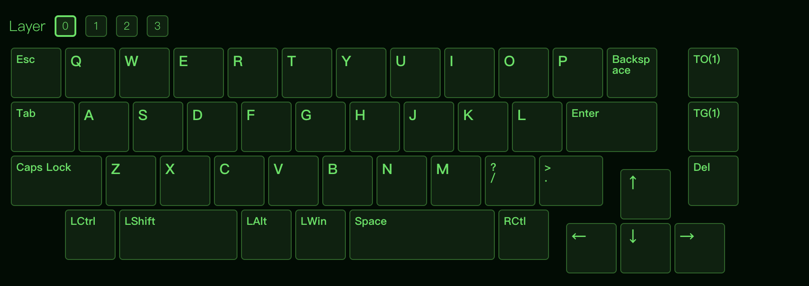
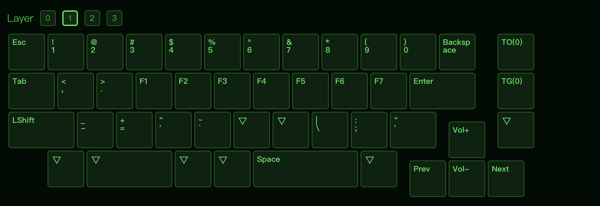

# Lele 46 - Scorpio Keyboard Configuration

This repository contains tools and guides to help you configure your Lele 46 - Scorpio keyboard for use with your MacBook Air M2.

## Quick Start

1. **Run the setup script**:
   ```bash
   ./setup-keyboard.sh
   ```

2. **Try Bluetooth pairing**:
   - Turn on your keyboard
   - Try these pairing combinations: `Fn + B`, `Fn + Space`, `Fn + 1`, or `Fn + 2`
   - Open System Preferences > Bluetooth on your Mac
   - Look for your keyboard and click "Connect"

3. **Test VIA compatibility**:
   - Connect your keyboard via USB
   - Open https://usevia.app/ in Chrome or Edge
   - Check if your keyboard appears in the device list

## Files in This Repository

- `setup-keyboard.sh` - Automated setup script for macOS
- `keyboard-research.md` - Detailed research and configuration options
- `troubleshooting-guide.md` - Common issues and solutions
- `README.md` - This file

## Configuration Options

### Option 1: VIA (Recommended - Easiest)
- Web-based configuration at https://usevia.app/
- Real-time key mapping
- No firmware flashing required
- Works with many QMK-based keyboards

### Option 2: QMK (Advanced)
- Full firmware customization
- Requires firmware compilation and flashing
- More powerful but complex

### Option 3: ZMK (Wireless-focused)
- Specifically designed for wireless keyboards
- Requires building custom firmware
- Excellent for Bluetooth keyboards

### Option 4: Karabiner-Elements (macOS-specific)
- Powerful key remapping for macOS
- Works with any keyboard
- Can create complex key combinations

## Troubleshooting

If you encounter issues:

1. Check the `troubleshooting-guide.md` file
2. Try the common key combinations listed in the guide
3. Use the system tools to identify your keyboard's firmware
4. Contact the manufacturer for support

## System Requirements

- macOS (tested on MacBook Air M2)
- Homebrew (will be installed automatically)
- Chrome or Edge browser (for VIA)

## Next Steps

After running the setup script:

1. **Test basic connectivity** - Try Bluetooth pairing first
2. **Check VIA compatibility** - This is the easiest configuration method
3. **Research your specific model** - Look for manufacturer documentation
4. **Consider firmware options** - Based on what you find

## Getting Help

- Check the troubleshooting guide
- Search online forums (Reddit r/MechanicalKeyboards, Geekhack)
- Contact the keyboard manufacturer
- Check for firmware updates

## Contributing

If you find solutions or improvements, feel free to contribute to this guide! 

Reference images:



